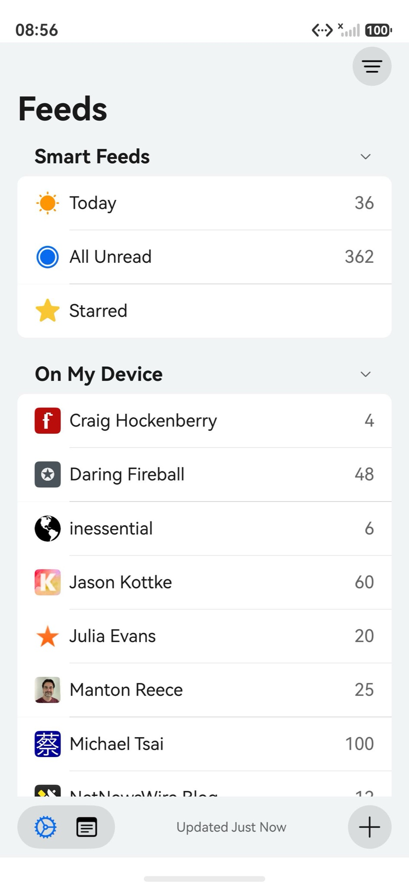
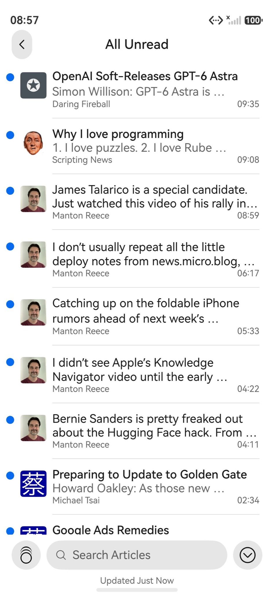
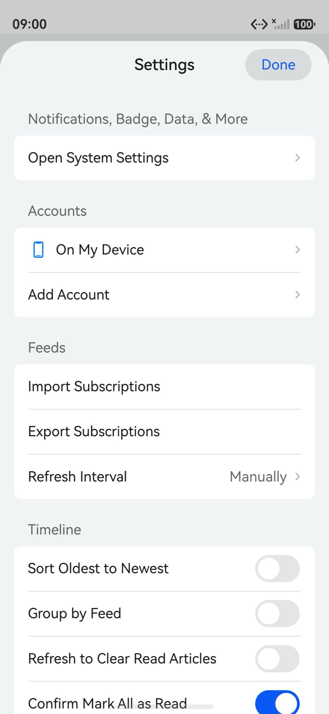
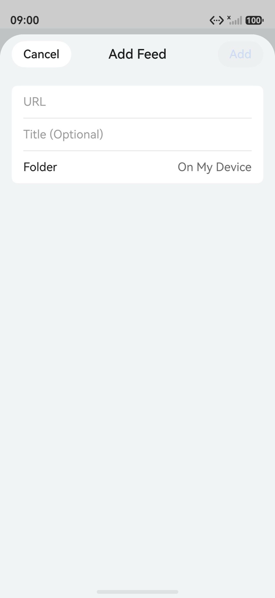

<p align="center"></p>
<h2 align="center"><b>NetNewsWire</b></h2>
<h4 align="center">The RSS reader for Mac and iOS, rebuilt natively for HarmonyOS.</h4>

<p align="center"></p>

> ### Please read this first
>
> This is an unofficial community port. It is not affiliated with, endorsed by, or supported by
> Brent Simmons, Ranchero Software, or the NetNewsWire project. If something here is broken, it is
> broken here. Do not open an issue upstream for it.
>
> The name NetNewsWire and the app icon belong to Ranchero Software. The MIT License covers the
> source code, not the name and not the artwork. Both are used here only to say what this is a port
> of, and both will change if the upstream authors would rather we did not use them.

<p align="center"><a href="#screenshots">Screenshots</a> &bull; <a href="#install">Install</a> &bull; <a href="#known-limits">Known limits</a> &bull; <a href="#license">License</a></p>

<hr>

NetNewsWire is a free and open-source feed reader for macOS and iOS, written by Brent Simmons and
the Ranchero Software team. This repository is the iOS app rewritten for HarmonyOS in ArkTS,
against ArkUI. It reads RSS, Atom and JSON Feed, talks to the same sync services, and keeps the
same database schema as the source app.

Upstream lives at [Ranchero-Software/NetNewsWire](https://github.com/Ranchero-Software/NetNewsWire).
This port is based on NetNewsWire for iOS 7.1.3 (upstream tag
[`iOS-7.1.3-7206`](https://github.com/Ranchero-Software/NetNewsWire/tree/iOS-7.1.3-7206)).
If you are on a Mac or an iPhone, go there instead. This port exists for people whose phone runs
HarmonyOS and who have nowhere else to read their feeds.

## Screenshots

<p align="center">





</p>

## Install

There is no prebuilt package here. You build it and sign it yourself, which also means the package
carries your certificate and your device list rather than someone else's.

You need DevEco Studio 6.x with the HarmonyOS SDK 6.1.1 (API 24), a Huawei developer account,
and a device running HarmonyOS.

1. Clone this repository and open the folder in DevEco Studio.
2. Go to **File > Project Structure > Signing Configs**. Sign in, connect the device, and let
   DevEco generate a signature. The bundle name is `com.ranchero.NetNewsWire.hmos`.
3. Build it: **Build > Build Hap(s)/APP(s) > Build Hap(s)**. The package lands in
   `entry/build/default/outputs/default/`.
4. Install and launch it:

```bash
hdc install -r entry-default-signed.hap
hdc shell aa start -a EntryAbility -b com.ranchero.NetNewsWire.hmos
```

A generated debug signature only installs on the devices registered to it, and it expires. When it
does, open the same dialog and generate it again.

## Known limits

- iCloud sync does not exist here. CloudKit is an Apple service.

## License

MIT, the same as upstream. `LICENSE` is the upstream file, unchanged:

```
Copyright (c) 2002-2025 Brent Simmons
```

Everything written for HarmonyOS is released under those same terms. `NOTICE` lists what came over
from upstream and the licenses of the fonts that ship inside the article themes, including Atkinson
Hyperlegible under the SIL Open Font License and ModeSeven as freeware.

More about NetNewsWire: [netnewswire.com](https://netnewswire.com/)
